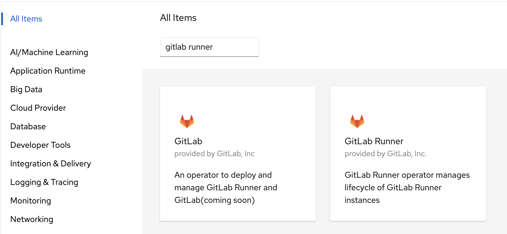
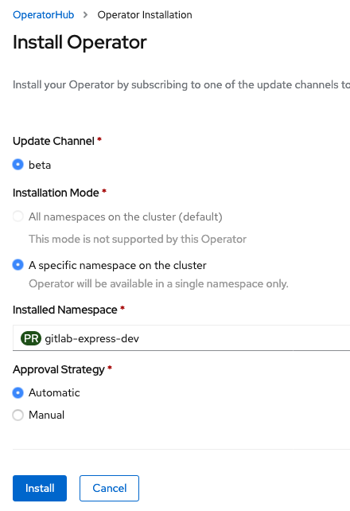

# Install GitLab Runner on OpenShift

> [Introduced](https://gitlab.com/gitlab-org/gitlab-runner/-/issues/26640) in GitLab 13.3.

You can install GitLab Runner on Red Hat OpenShift.

## Prerequisites

- OpenShift 4.x cluster with administrator privileges
- GitLab Runner registration token

### Install the OpenShift Operator

1. Open the OpenShift UI.
1. In the left pane, click **Operators**, then **OperatorHub**.
1. In the main pane, below **All Items**, search for the keyword `GitLab`.

   

1. To install, click the GitLab Operator.
1. On the GitLab Operator summary page, click **Install**.
1. On the Install Operator page, under **Installed Namespace**, select the desired namespace and click **Install**.

   

On the Installed Operators page, when the GitLab Operator is ready, the status changes to **Succeeded**.


#### Install GitLab Runner

1. Obtain the Runner registration token by going to the project's **Settings > CI/CD** and
   expanding the **Runners** section.
1. Under **Use the following registration token during setup:**, copy the token.
1. Open an OpenShift console and switch to the project namespace:

   ```shell
   oc project "PROJECT NAMESPACE"
   ```

1. Use the following command with your Runner token:

   ```shell
   oc create secret generic gitlab-runner-secret --from-literal runner_registration_token="xxx"
   ```

1. Next, create the CRD file.

   ```shell
   nano gitlab-runner.yml
   ```

1. Add the following to the CRD file and save:

   ```yaml
   apiVersion: gitlab.com/v1beta1
   kind: Runner
   metadata:
     name: gitlab-runner
   spec:
     gitlab:
       url: "https://gitlab.example.com"
     token: gitlab-runner-secret
     tags: openshift
   ```

1. Now apply the CRD file by running the command:

   ```shell
   oc apply -f gitlab-runner.yml
   ```
